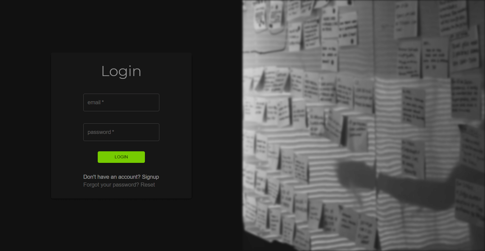
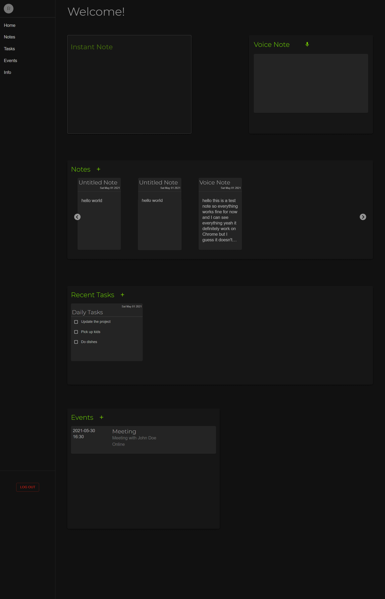
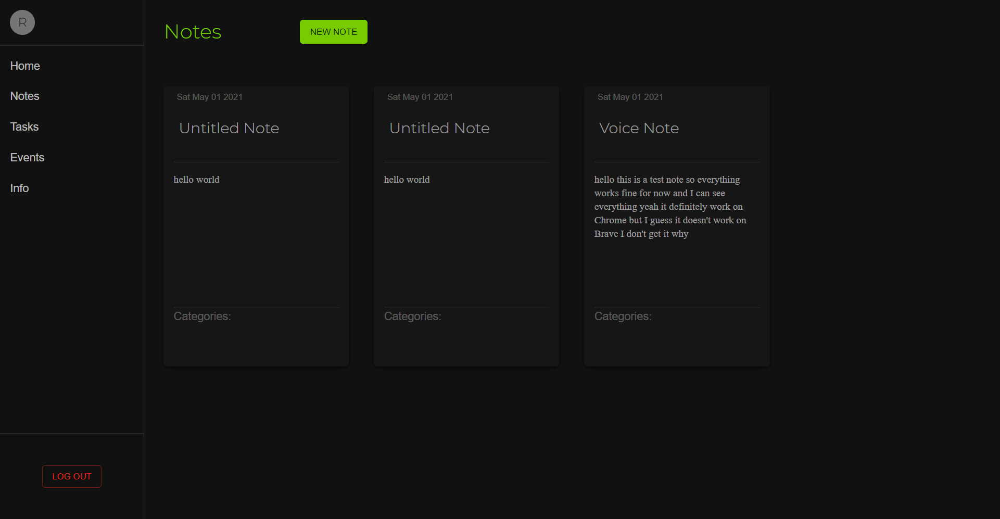
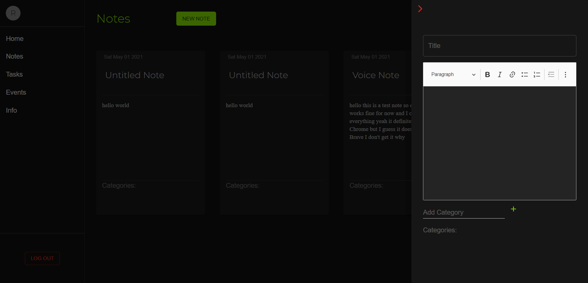
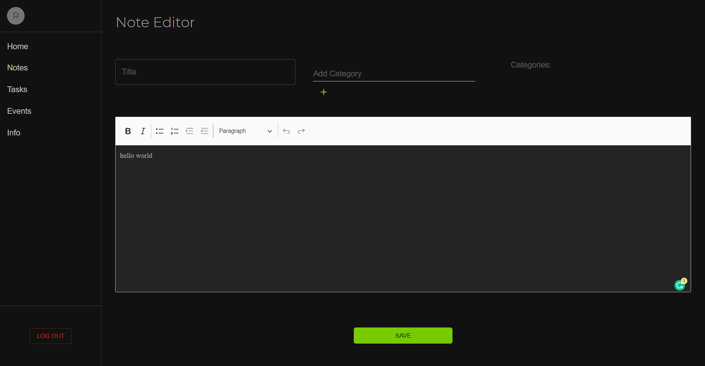
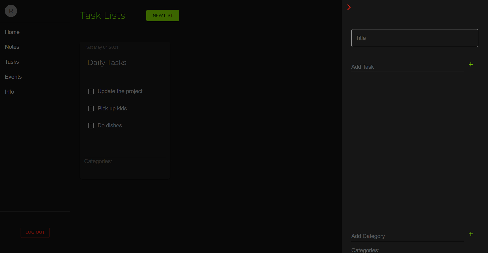
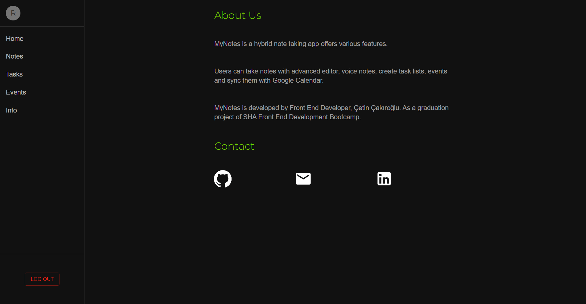

# Project: MyNotes Web App

- MyNotes is a hybrit note taking web app based on widgets.
- Users can signup or login with mail.
- Users can take notes with advanced editor, voice notes, create task lists, set events and sync with Google Calendar.
- **This project is a result of 2 weeks personal sprint period. Some features are not cross browser yet. Google Chrome is recommended browser to test demo.**
- MyNotes is a final personal project of **Social Hackers Academy Front End Development Course**
- More features, bug fixes, updates will come as the development process continues.
- Note that this version is designed to be a web app which means it's not 100% responsive by nature. As a part of production strategy project is divided in 3 paths, at the end of production there will be 3 versions. Web (React), Mobile (React Native) & Desktop (Electron).

### Technologies & Tools Used
- JavaScript
- React
- React Router Dom
- Context API
- Material UI
- Google APIs
- Firebase auth & firestore (db is in progress).
- Netlify
- Figma
- 3rd party libraries

**To use the demo, you can sign up with a dummy email (for exampple: xyz@asd.com).**
**Note that Voice Notes feature is currently in experimental status and works best in Chrome."
[DEMO](https://mynotes-web.netlify.app/) 

### Project Images

- Login/Signup

- Home

- Notes

- Tasks

- Info

---
### Task List (Sprint 1 / Status: Completed)
### Stage I // Design & Prepare React Environment
- [x] Design project components & widgets in Figma.
- [x] Create React Environment in local.
- [x] Install Packages.
- [x] Create folder structure.
- [x] Code basic outlines.
- [x] Implement React router structure.
- [x] Build Material UI custom theme.
- [x] Build side nav & implement redirecting.

### Stage II// Build Widgets
- [x] Build Home, Widgets, ContextAPI structure.
    1. [x] Notes Widget, implement Sliderjs to show cards.
        - [x] In here, notes will be read only. Add routing on click.
        - [x] Implement Sliderjs and make adjustments.
        - [x] Add editor drawer.
    2. [x] Instant Note Widget.
        - [x] Implement a form & text field which will allow user to create basic/undecorated text notes.
    3. [x] Voice Note Widget
        - [ ] Implement Google Speech-to-Text API. ( Will be added in second sprint )
        - [x] Add JS Speech Recognition. ( This is an experimental feature, will be replaced with Google Speech-to-Text API )
        - [x] Check the user's browser to display widget in the home page or not.
    4. [x] Task List Widget.
        - [x] Make each task appear in card, user only allowed to change checkbox status.
        - [x] Build in-component drawer for input group.
    5. [x] Events Widget.
        - [x] Build in-component drawer for input group.
        - [x] Implement Google Calendar API and sync events. (Update-only for now)

### Stage III // Build Components & Deploy
- [x] Build Notes Component.
    1. [x] Display notes in separate cards and each card should have delete, edit, update button. (Appear at hover)
    2. [x] Make instant edit feature. User will edit the text directly in the card without opening editor.
    3. [x] Make the 'New Note' button and open editor drawer on click.
    4. [x] Build a submit in Editor handling mechanism which will decide to edit or create new note.
    5. [x] Implement CKEditor5 Classic Editor.
- [x] Build Tasks Component.
    1. [x] Build input drawer & 'New' button.
    2. [x] Display each task list in a card. In cards, every task list item will have checkboxes & delete buttons.
    3. [x] Make each editable, user can edit text directly.
- [x] Auth
    1. [x] Install Firebase & create project in Firebase console, enable Email & Google Sign In methods.
    2. [x] Create real time database in Firestore.
    3. [x] Build Login/Signup/Logout components.
    4. [x] Refactor Routing, add redirect.
- [x] Build static components.
- [ ] Refactor CSS, create a Context to distribute common styles.
- [x] Deploy in Netlify.
---
#### Update List
- [ ] Add user feedback, manage & display errors properly.
- [ ] Improve Auth. Add Google, GitHub sign in methods.
- [ ] Store user data in Firestore, create a data structure for every user & store everything.
- [ ] Update events, sync user's all events from Google Calendar and display in widgets. Add reminders & send sms/email notification to users.
- [ ] Update Voice Note feature, make it cross browser. Switch to Google Speech-to-Text API.
- [ ] Update Note Editor. Allow users to upload documents & media files.
- [ ] Update Instant Note, add Balloon Editor.
- [ ] Implement Voice Command feature to navigate and use the app.
- [ ] Update task list input group, add Balloon Editor.
- [ ] Update side nav, make it treeview, display categories.
- [ ] Implement dynamic search bar.
- [ ] Create user profile area & make it editable.
- [ ] Add finance & email widgets.
- [ ] Make the notes downloadable & shareable in pdf, word, docs formats.

